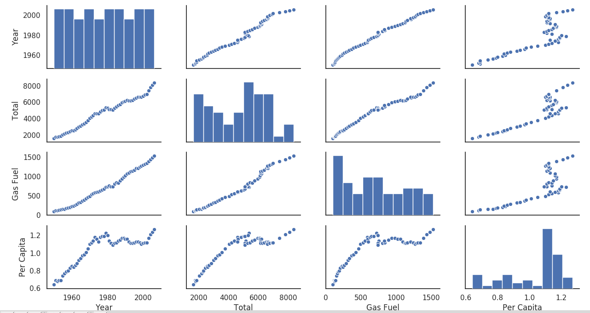
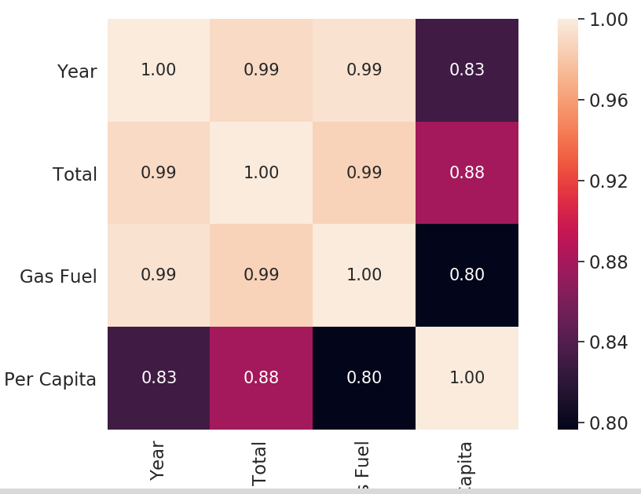
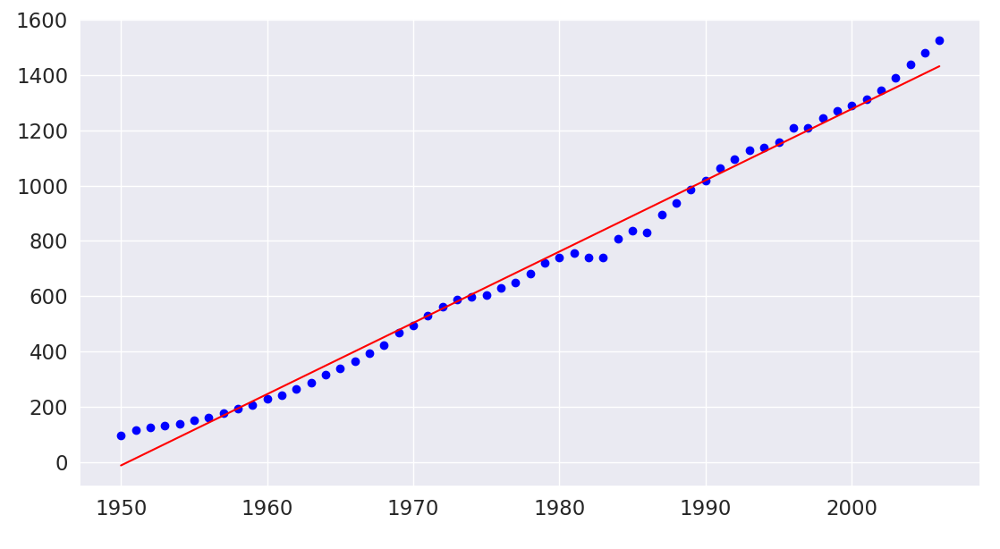
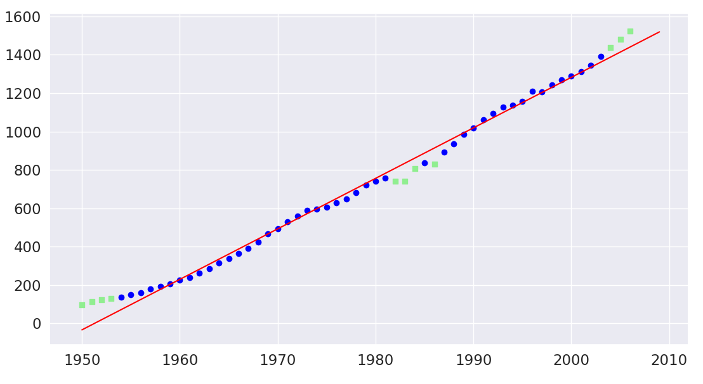

# Отчет по лабораторной работе
## по курсу "Искусственый интеллект"

## Линейная регрессия

### Студенты: Лебедев И.Н.

## Результат проверки

| Преподаватель     | Дата         |  Оценка       |
|-------------------|--------------|---------------|
| Самир Ахмед       |              |               |

> *Комментарии проверяющих (обратите внимание, что более подробные комментарии возможны непосредственно в репозитории по тексту программы)*

## Тема работы

Реализовать модель линейной регрессии для набора данных Global_co2.csv

## Решение

Первым шагом были визуализированы все данные. При этом с помощью средств Pytyhon были построены графики зависимости данных. Был проведен разведочный анализ данных.  
 
Из приведенных графиков видно, что существует, возможно, линейная связь между Year и Gas Fuel.  
Чтобы понять, зависят ли признаки друг от друга, построим корреляционную матрицу. Используя функцию corrcoef из библиотеки Python NumPy.  

Используя объект линейной регрессии LinearRegression библиотеки scikit-learn, в котором используются динамическая библиотека LIBLINEAR и продвинутые алгоритмы оптимизации, которые лучше работают с нестандартизированными переменными, расчитаем параметры для нашей линейной регрессионной модели.  

Для исследования качества модели предскажем знаение Gas Fuel для Year, которого не было в тренировочных данных.  
Предсказанное значение - 1458, фактическое значение - 1572.  То есть ошибка предсказания составляет примерно 7.25% от фактической величины признака.  
Также были изучены базовые приемы работы с алгоритмом RANSAC для определения выбросов. (На графике выбросы обозначены зеленым цветом).  

Предсказанное значение - 1467, фактическое значение - 1572. Ошибка снижается до 6.67%.  

## Выводы

При выполнении этой лабораторной работы я познакомился с базовым алгоритмом машинного обучения - линейной регрессией. Линейная регрессия позволяет нам установить зависимость (смоделировать связь) между условной переменной X и зависимой переменной Y. Установив зависимость между X и Y на тренировоном наборе данных, мы можем далее использовать эту связь для предсказания новых значений Y по новым X, которых не было в тренировочном наборе.
